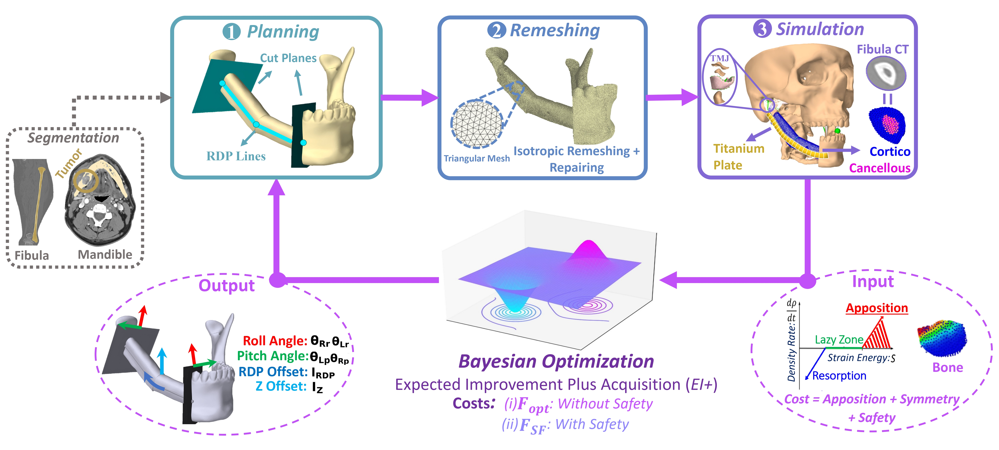
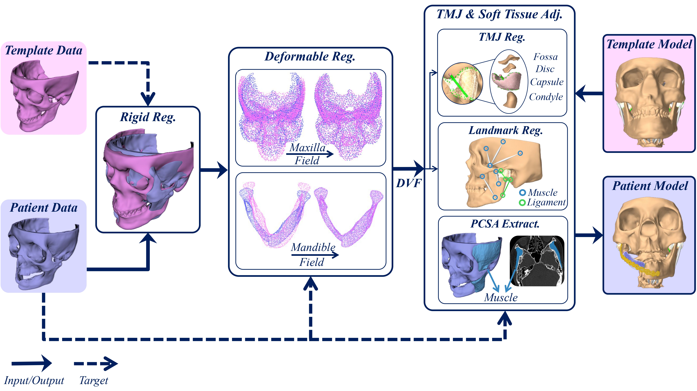

# OsteoOpt++: Patient-Specific Optimization for Mandibular Reconstruction Planning with Enhanced Bone Union

[](https://arxiv.org/abs/2605.01084)
[](https://arxiv.org/abs/2605.01084v1)
[](LICENSE)
[](#)

OsteoOpt++ is the extended version of OsteoOpt, an image-to-decision
framework for mandibular reconstruction. It combines virtual surgical planning,
ArtiSynth simulation, and Bayesian optimization to search reconstruction
variables that improve predicted donor-host bone union.

Extended version: [OsteoOpt++ arXiv:2605.01084v1](https://arxiv.org/abs/2605.01084v1).
Earlier conference version: [OsteoOpt MICCAI 2025](https://www.researchgate.net/publication/395706192_OsteoOpt_A_Bayesian_Optimization_Framework_for_Enhancing_Bone_Union_Likelihood_in_Mandibular_Reconstruction_Surgery).

## To-Do List

* [x] ~~Fix bugs in the two cost functions.~~
* [x] ~~Fix bugs in the capsule-based dual deformable registration.~~
* [ ] Provide example geometry files and document the component-naming conventions.
* [ ] Add the complete segmentation code for the four masticatory muscles.
* [ ] Add the resection-plane definition for PCSA calculation.

**Demo: one optimization iteration for the Body (B) defect case.**

https://github.com/user-attachments/assets/8453a34e-4e47-47cb-96e5-db6c425aa94e

## Repository Layout

* `artisynth_JawModel/` - ArtiSynth jaw model, simulation code, and MATLAB
  optimization scripts.
* `artisynth_JawModel/src/artisynth/JawModel/patient_specific/` -
  patient-specific registration and model-construction scripts.
* `artisynth_VSP/` - virtual surgical planning and reconstruction components.
* `assets/` - README figures.

## Optimization Workflow



The optimization loop generates a candidate reconstruction, remeshes the
geometry, runs a chewing simulation, evaluates apposition and safety metrics,
and sends the cost back to the Bayesian optimizer.

Optimization entry points:

```text
artisynth_JawModel/src/artisynth/JawModel/matlab/MainOneSegment.m
artisynth_JawModel/src/artisynth/JawModel/matlab/MainTwoSegment.m
```

## Patient-Specific Modeling



The patient-specific layer is a registration and model-construction
preprocessing step. It registers the generic template model to CT-derived
patient anatomy, transfers muscle and ligament attachments, updates muscle and
ligament parameters, adapts the TMJ soft tissues, and produces the patient
digital twin used by the optimization workflow.

Patient-specific registration entry point:

```text
artisynth_JawModel/src/artisynth/JawModel/patient_specific/matlab/Registration_Artisynth_Main.m
```

## Setup

Tested on Windows.

1. Install **JDK 8 or higher** and **Eclipse IDE**.

2. Clone **ArtiSynth Core**:

   ```text
   https://github.com/artisynth/artisynth_core.git
   ```

3. In Eclipse/ArtiSynth, add the model packages and make `artisynth_VSP` and
   `artisynth_JawModel` visible on the external classpath.

4. Set `ARTISYNTH_HOME` to the local `artisynth_core` checkout. In MATLAB:

   ```matlab
   addpath(fullfile(getenv('ARTISYNTH_HOME'), 'matlab'));
   setArtisynthClasspath(getenv('ARTISYNTH_HOME'));
   ```

5. Create an Anaconda Python environment and install the Python libraries called
   from MATLAB:

   ```bash
   conda create -n osteoopt python=3.8
   conda activate osteoopt
   pip install -r artisynth_JawModel/src/artisynth/JawModel/patient_specific/matlab/requirements.txt
   ```

   ```matlab
   pyenv('Version', 'C:\path\to\anaconda3\envs\osteoopt\python.exe')
   ```

Patient-specific muscle-force estimation also requires CT muscle segmentation
and scan cross-section analysis before running the registration/model-construction
script. **The CT muscle segmentation and scan cross-section code will be added
soon.**

## Running

For generic optimization, open MATLAB in:

```text
artisynth_JawModel/src/artisynth/JawModel/matlab
```

Run `MainOneSegment.m` for one-segment defects or `MainTwoSegment.m` for
two-segment defects.

The ArtiSynth mesh/body mapping is defined in
`artisynth_JawModel/src/artisynth/JawModel/geometry/bodyList.txt`. The checked-in
list is for one-segment reconstruction; for two-segment reconstruction,
uncomment `donor_mesh1` and `screw1`.

For patient-specific registration/model construction, open MATLAB in:

```text
artisynth_JawModel/src/artisynth/JawModel/patient_specific/matlab
```

Place the required patient geometry inputs in `../geometry`, create a local
`SCSA.txt` from `SCSA.example.txt`, and run:

```matlab
Registration_Artisynth_Main
```

## Citation

If you use OsteoOpt++, please cite the extended arXiv version:

```bibtex
@misc{aftabi2026patient,
  title = {Patient-Specific Optimization for Mandibular Reconstruction Planning with Enhanced Bone Union},
  author = {Aftabi, Hamidreza and Lloyd, John E. and Ding, Amanda and Sagl, Benedikt and Prisman, Eitan and Hodgson, Antony and Fels, Sidney},
  year = {2026},
  eprint = {2605.01084},
  archivePrefix = {arXiv},
  primaryClass = {cs.CV},
  url = {https://arxiv.org/abs/2605.01084}
}
```

Please also cite the earlier OsteoOpt MICCAI conference paper
([ResearchGate](https://www.researchgate.net/publication/395706192_OsteoOpt_A_Bayesian_Optimization_Framework_for_Enhancing_Bone_Union_Likelihood_in_Mandibular_Reconstruction_Surgery)):

```bibtex
@inproceedings{aftabi2025osteoopt,
  title = {{OsteoOpt}: A Bayesian Optimization Framework for Enhancing Bone Union Likelihood in Mandibular Reconstruction Surgery},
  author = {Aftabi, Hamidreza and Lloyd, John E. and Ding, Amanda and Sagl, Benedikt and Prisman, Eitan and Hodgson, Antony and Fels, Sidney},
  booktitle = {International Conference on Medical Image Computing and Computer-Assisted Intervention},
  pages = {448--458},
  year = {2025},
  organization = {Springer}
}
```

## License

OsteoOpt++ is source-available for noncommercial research and educational use
under the [PolyForm Noncommercial License 1.0.0](LICENSE). Commercial use
requires separate written permission from the authors. See [NOTICE](NOTICE) for
the required copyright notice.

## Ethics and Data Access

Patient-specific CT volumes and meshes are not included due to ethics and
privacy constraints.
